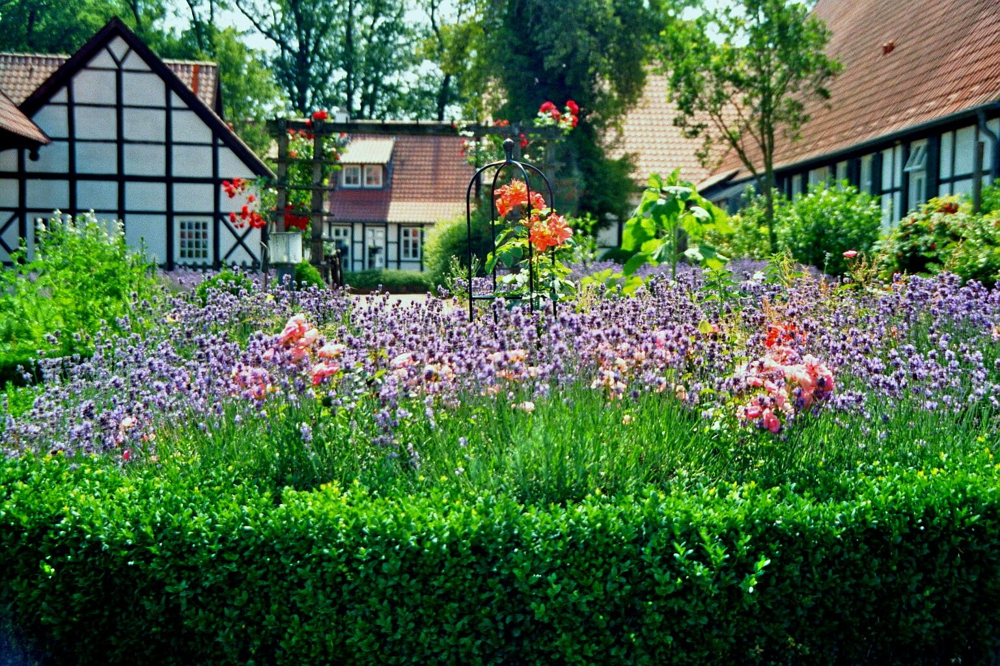
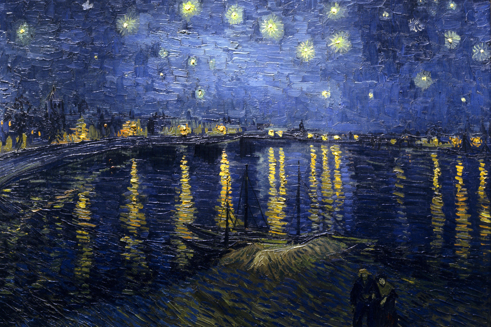
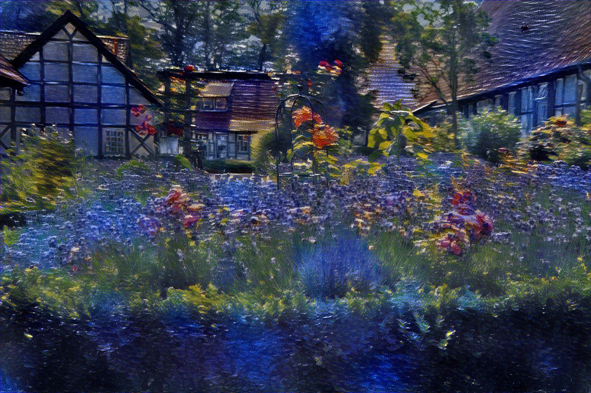

style-transfer
==============

This is a [TensorFlow](https://github.com/tensorflow/tensorflow) implementation of style transfer as described in [A Neural Algorithm of Artistic Style](https://arxiv.org/pdf/1508.06576.pdf). This also implements a variation of the color preservation strategy described in [Preserving Color in Neural Artistic Style Transfer](https://arxiv.org/pdf/1606.05897.pdf).

Basic Style Transfer
--------------

 


Style Transfer with Color Preservation
--------------------------------------

 


Usage
-----

Basic style transfer demo:

```bash
python main.py
```

Style transfer with color preservation demo:

```bash
python main.py --preserve_color
```

Style transfer on custom images:

```bash
python main.py --content <custom_content.jpg> --style <custom_style.jpg> --output <output_dir>
```

Requirements
------------

* [tensorflow](https://github.com/tensorflow/tensorflow/tree/r0.12) 0.12
* cv2
* scikit-image
* scipy
* pretrained VGG-19 npy model from [tensorflow-vgg](https://github.com/machrisaa/tensorflow-vgg)
